# Pusula — Sunum Ekleri (Yeni Özellikler)

> Bu dosya, ilk sunumdan sonra eklenen tüm yeni yetenekleri **sunuma eklenebilir ekler**
> hâlinde toplar. Her ek: tek cümlelik başlık + ne/neden + ekran görselidir.
> Görseller: `ekler-gorseller/` (1440×900 @2x, `/pusula` ekranından).
> Hepsi **üç dilli** (TR · EN · ES) — örnek için bkz. **Ek B-2**.

İçindekiler:
- **Ek A — Saha Krokisi** (mağazayı tanıyan, metrik-sürümlü yerleşim)
- **Ek B — İnsan** (derin profil · çok-dillilik · zengin önizleme · yeni filtreler)
- **Ek C — Gelişim Defteri** (interaktif yetkinlik · takip edilebilir dönem · tek-not takip)
- **Ek D — Öğrenen Hafıza & Usta Yolu** (kanıt rozetleri · onaylı eşleşme)
- **Ek E — Sonuç** (cilalanmış yerleşim grafikleri)
- **Ek F — Cila & Tutarlılık** (estetik dil, harmoni)

---

## Ek A — Saha Krokisi
**Tek cümle:** *Pusula mağazanın gerçek krokisini ve zone'larını tanır; her alanı kendi metriğinden besler, müsait eli doğru zone'a eşler.*

### A-1 · Mağazayı tanıyan kroki — üç bölüm
Gerçek mağaza planı (Bornova) üç reyona ayrılır ve renkle kodlanır:
**Kadın** (altın · sol) · **Çocuk** (yeşil · orta) · **Erkek** (koyu · sağ) + ortak **Kasa/ACO** hattı.
19 alan gerçek mimariye göre konumlanır (Kabin Welcomer, Kabin, Zone 1–5, Welcome, girişler).
Canlı yoğunluk her alanda dinamik (nabız) bir işaretle gösterilir.

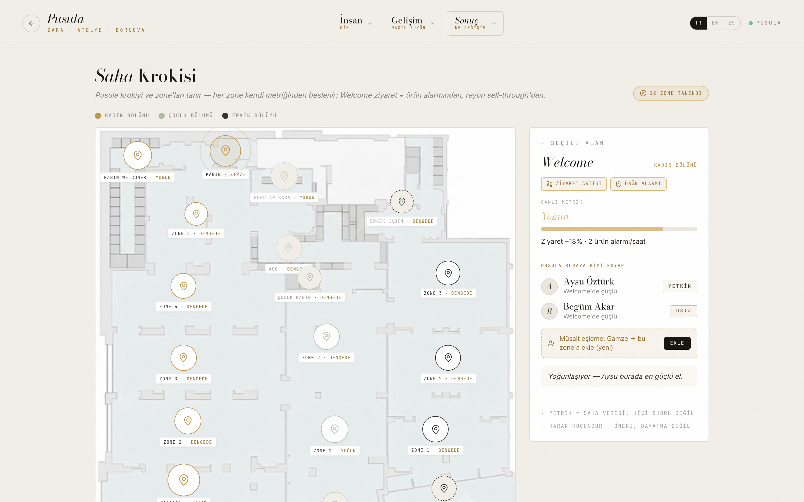

### A-2 · Zone metriği + müsait eşleme
Her zone'u **farklı bir metrik sürükler** (senin tarif ettiğin gibi):
- **Welcome** → ziyaret artışı (footfall) + **ürün alarmı** (EAS)
- **Kabin** → kabin trafiği · bekleme · dönüşüm
- **Kasa/ACO** → kuyruk · işlem hızı
- **Reyon (Zone 1–5)** → sell-through · reyon dönüşümü

Bir zone'a tıklayınca: sürücü çipleri + canlı okuma → **Pusula buraya kimi koyar** (yetkinlikten, nitel) → **müsait (boştaki) eli o zone'a EKLE**. "Ekle" → kişi yerleşime akar ("müsaitten eklendi", geri alınabilir). Sert skor yok; karar koçundur.

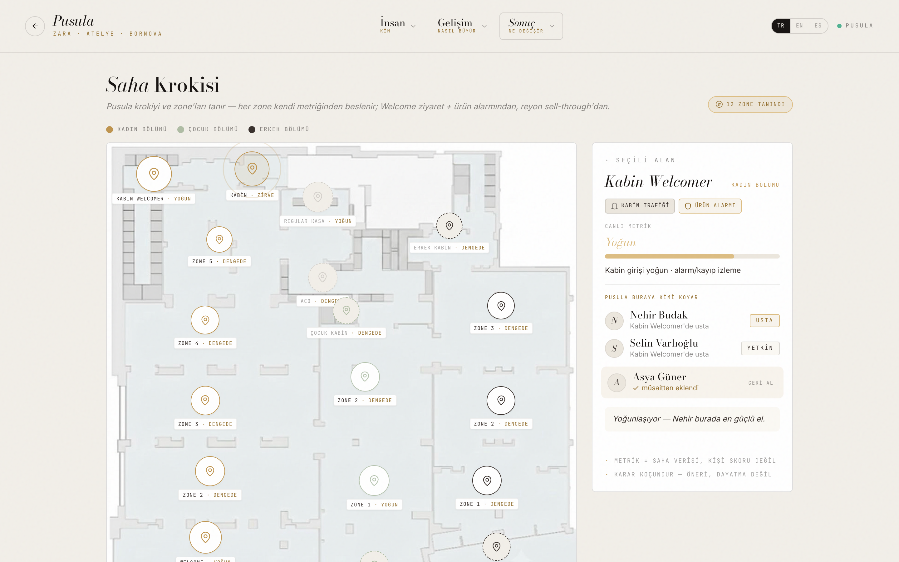

---

## Ek B — İnsan (İnsan ana sahnedir)

### B-1 · Kişiye-özel derin profil + tahmin
**Tek cümle:** *Her metrik kişinin gerçek yetkinlik vektöründen türer — iki kişi asla aynı değildir.*
- **Yaklaşan eğitimler** — gelişim arkından sıradaki adımlar (odak · ne zaman · kiminle)
- **ASA güç dağılımı** — 4 Ana Sorumluluk Alanı 0–100 bar + bu dönem artış (+Δ) + kanıt KPI
- **Gelişim yörüngesi · tahmin** — geçmiş 4 hafta (dolu) + 2 hafta **tahmin** (kesik) + Usta eşiği ETA'sı
- **Rol uygunluğu · hazırlık** — hangi role ne kadar hazır (hazır / gelişiyor / erken)
- **Persona** (Welcomer / Approacher / Mix&Match) + beceri matrisi + alan sinyalleri

> Skor **bireyin gelişimi** içindir — kişiler arası sıralama değil.

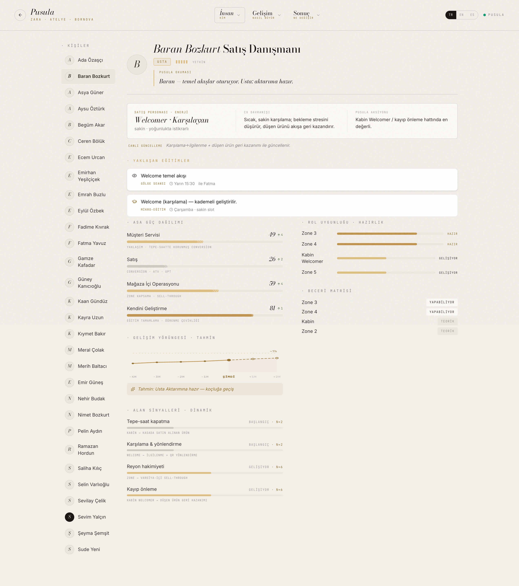

### B-2 · Çok-dillilik (TR · EN · ES)
**Tek cümle:** *Yalnız başlıklar değil — tüm içerik (120 kitapçık konusu, koç notları, persona, tahminler dâhil) üç dilde.*
Sağ üstten TR/EN/ES; sistem/özel adlar (One Store, QR, ITX, zone adları) korunur.

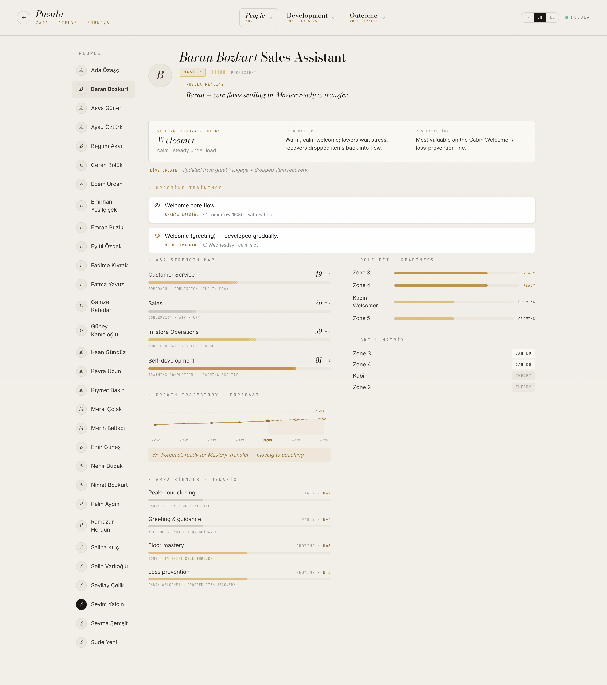

### B-3 · Zengin hızlı önizleme (peek drawer)
**Tek cümle:** *Kartı açmadan: persona + güç ibaresi + yaklaşan eğitimler + ASA güç dağılımı.*

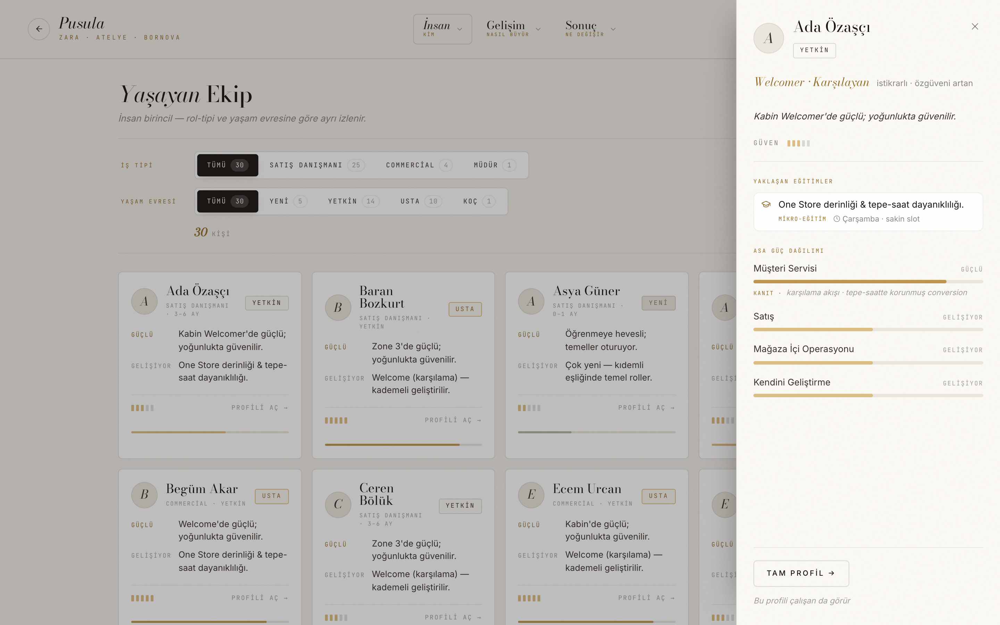

### B-4 · Yeni filtre barı
**Tek cümle:** *Sayı rozetli, kolay kullanımlı segment filtreler — taşma/karmaşa yok.*
İş tipi ve yaşam evresi ayrı satırlar, her seçenekte canlı sayı + sonuç sayacı.

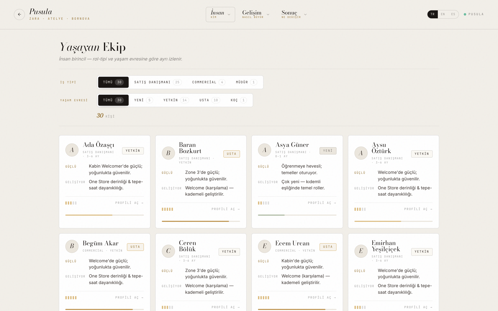

---

## Ek C — Gelişim Defteri (her tab eklenebilir & takip edilebilir)

### C-1 · İnteraktif Yetkinlik
**Tek cümle:** *Yetkinlik artık canlı: hücreye tıkla → seviye; isme tıkla → eğitim önceliği; + not → gözlem.*
5 davranışsal yetkinlik × 4 dönem; tüm değişiklikler takip edilir (değişen hücre altın işaretli, öncelikli satır altın tint). 0–5 ölçeği **etiketle** gösterilir, sayı basılmaz.

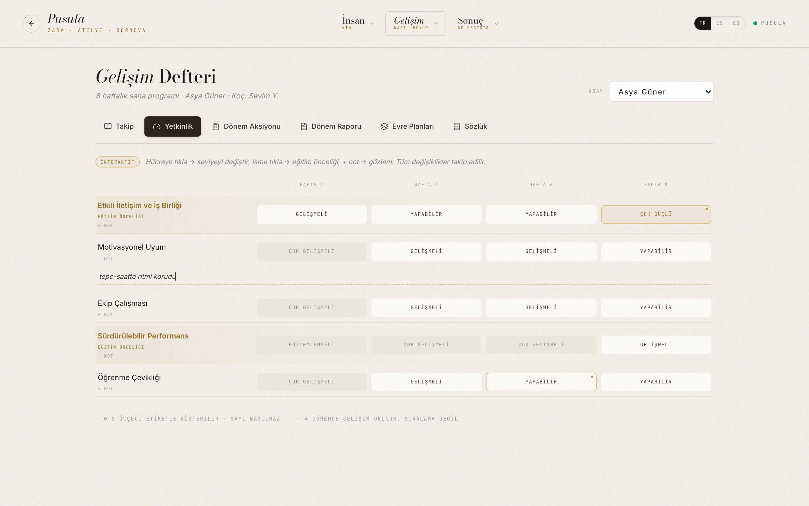

### C-2 · Takip edilebilir Dönem Aksiyonu
**Tek cümle:** *Öncelikler işaretlenebilir (tamamlandı), her hafta kartında ilerleme sayacı; hedef/aksiyon düzenlenebilir.*

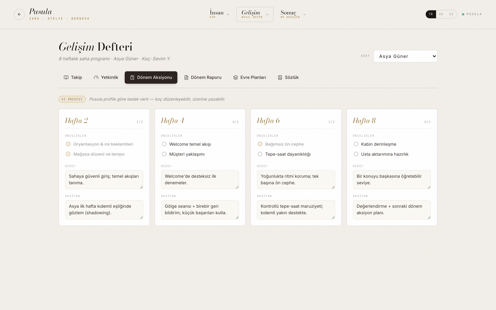

### C-3 · Tek-not takip + hızlı filtre
**Tek cümle:** *Her işaretleme TEK not bırakır (artık çoğalmıyor), not hover ile açılır; kategori ilerlemesi + hızlı filtre (Tümü / İşaretlenmemiş / Öğretebilir).*

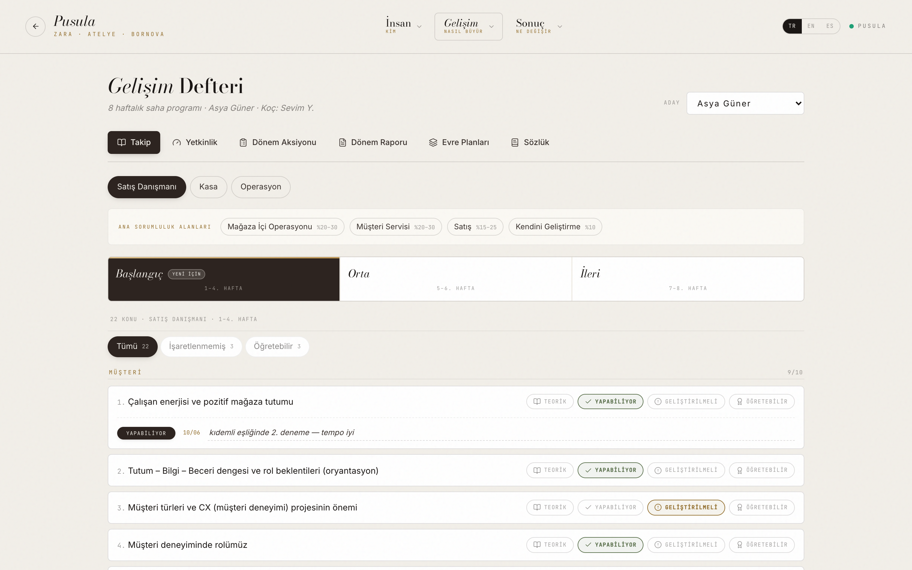

---

## Ek D — Öğrenen Hafıza & Usta Yolu

### D-1 · Hafıza — kanıt rozetleri
**Tek cümle:** *Notu olan kişiler öne çıkar, her birinde not sayısı rozeti — "bilgi kaybolmasın" görünür olur.*

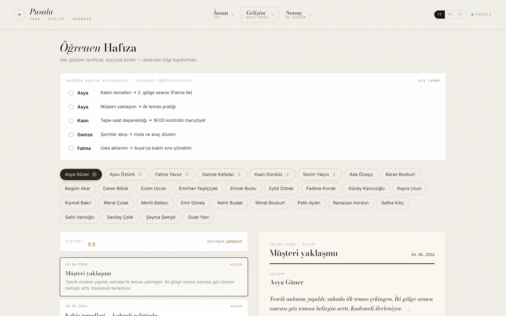

### D-2 · Usta Yolu — onaylı eşleşme
**Tek cümle:** *Koç eşleşmeyi onaylar → satır altın "Onaylandı ✓" durumuna geçer (insan-onayı görünür).*

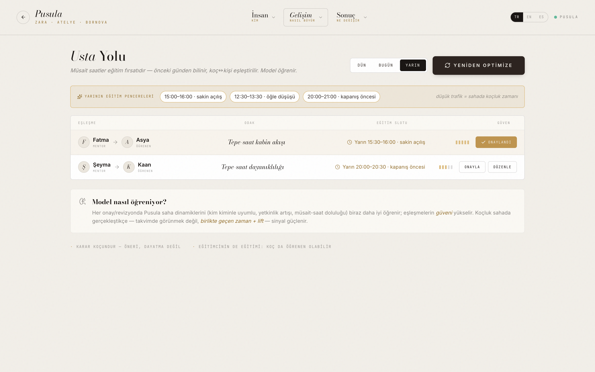

---

## Ek E — Sonuç · Cilalanmış Yerleşim Grafikleri
**Tek cümle:** *Talep barları taban çizgili & yumuşak gradient; saatlik akışta cep bandı yumuşatıldı — sakin editöryel dil.*
Talep + kadro + surplus + saatlik akış (trafik ↑ / conversion ↓ cebi) tek nefeste okunur; chart kadroya oturur.

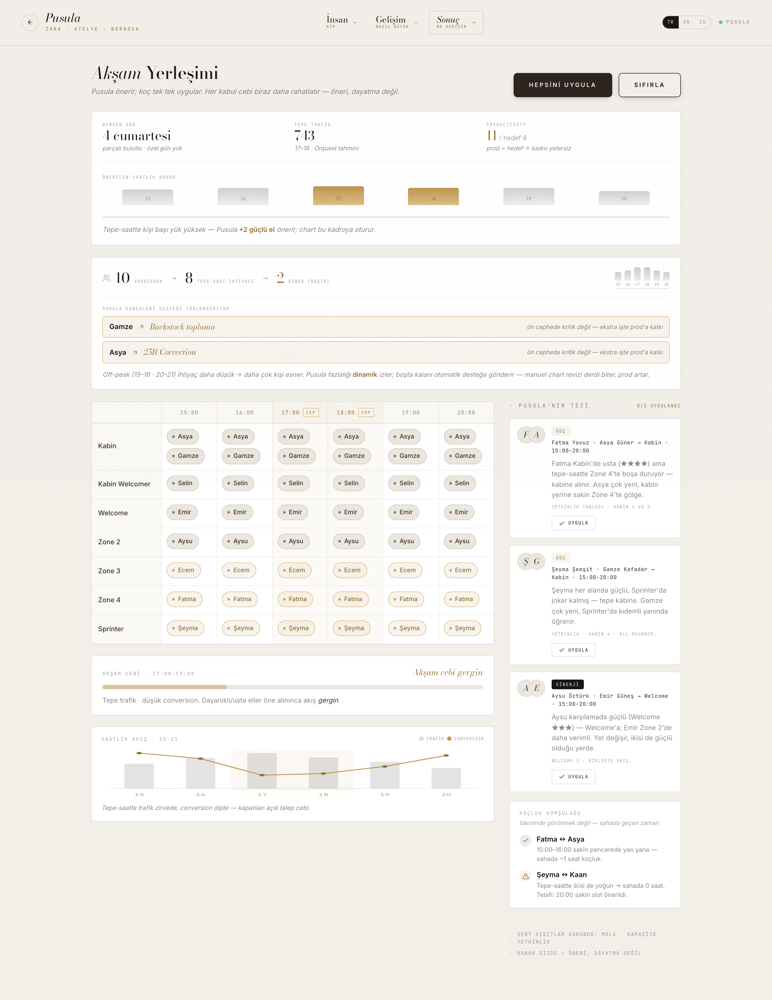

---

## Ek F — Cila & Tutarlılık
- **Yumuşak butonlar:** saf siyah aktif durumlar → sıcak **espresso** + yumuşak gölge + pürüzsüz geçiş; seviye tablarında ince **altın aksan**. Tüm ekranlarda tek dil.
- **Harmoni:** tek espresso tonu, tek kart radius (6px), tutarlı altın "seçim" ağırlığı; kroki bölüm renkleri lejantla.
- **Doğrulama:** her tur `tsc` + `eslint` + `vite build` temiz; UI self-check'i ayrı bir görsel-inceleme ajanına yaptırıldı (taşma/hizalama/kontrast/harmoni).

---

### Görselleri tazelemek (uygulama değişirse)
`npm run dev` açıkken Puppeteer betiğiyle `ekler-gorseller/` yenilenir
(1440×900 @2x, `/pusula` ekranından). İçerik mock'tur; ana site / solver bozulmaz.
